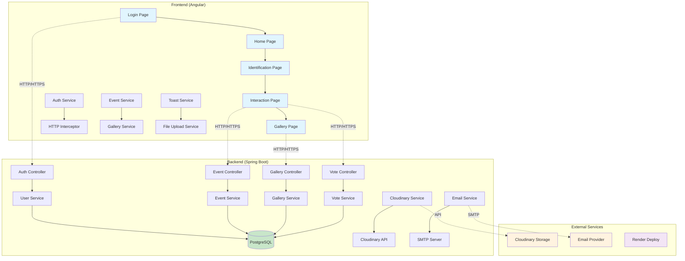

# 👦👧 Pedro ou Eduarda? - Chá Revelação

## 📋 Índice

- [Introdução](#-introdução)
- [Tecnologias Utilizadas](#-tecnologias-utilizadas)
  - [x] [Resumo completo das tecnologias]()
- [Desafio do Projeto](#-desafio-do-projeto)
- [Objetivos](#-objetivos)
  - [x] [Pré-requisitos](#-pré-requisitos)
  - [x] [Estrutura do Projeto](#-estrutura-do-projeto)
  - [x] [Regras e Validações](#-regras-e-validações)
  - [x] [Especificações de Conteúdo](#-especificações-de-conteúdo)
  - [x] [Especificações Técnicas](#-especificações-técnicas)
- [Diagrama da Aplicação](#-diagrama-da-aplicação)
- [Execução do Projeto](#-execução-do-projeto)
- [Deploy](#-deploy)
- [Créditos](#-créditos-e-autores)
- [Links Úteis](#-links-úteis)

## 🌟 Introdução

O projeto **Pedro ou Eduarda** nasceu do carinho e da expectativa em torno do chá revelação de uma família especial. Desenvolvido pela equipe Memuvie, esta aplicação web oferece uma experiência única e interativa para os convidados participarem ativamente da revelação do sexo do bebê.

A plataforma permite que familiares e amigos:
- 📸 Compartilhem fotos e vídeos da festa 
- 🎥 Enviem vídeos de depoimentos para o bebê
- 💌 Envie postagens com foto e uma mensagem especial
- 📊 Acompanhem em tempo real as postagens dos convidados

## 💻 Tecnologias Utilizadas

| Linguagens de Programação | Ferramentas e Tecnologias |
| :-----------------: | :-----------------------: |
|           |      

### ⚙️ Resumo completo das tecnologias

| Backend | Frontend | DevOps & Deploy | Ferramentas de Desenvolvimento |
| :---------------: | :-----------------------: | :-----------------------: | :-----------------------: |
| **Java 21** - Linguagem de programação principal  | **Angular 19.1.0** - Framework frontend | Docker & Docker Compose** - Containerização | **VS Code** - IDE principal
**Spring Boot 3.5.6** - Framework principal do backend | **TypeScript 5.0+** - Linguagem de programação | **Render** - Plataforma de deploy | **Postman** - Testes de API
**Spring Security** - Autenticação e autorização | **Angular Material** - Componentes UI | **GitHub Actions** - CI/CD (futuro) | **Git** - Controle de versão
**Spring Data JPA** - Persistência de dados | **RxJS** - Programação reativa | **Maven** - Gerenciamento de dependências (Backend) | Repositório de código
**JWT** - Autenticação stateless | **Angular Router** - Roteamento | **npm** - Gerenciamento de dependências (Frontend)
**PostgreSQL** - Banco de dados principal | **Angular Forms** - Formulários reativos
**Flyway** - Migração de banco de dados | **HTTP Client** - Comunicação com API
**ModelMapper** - Mapeamento de objetos | **Angular SSR** - Server-Side Rendering
**SpringDoc OpenAPI** - Documentação da API
**Cloudinary** - Armazenamento de imagens e vídeos
**JavaMail** - Envio de emails
**Docker** - Containerização


## 🎯 Desafio do Projeto

### **Desafios Técnicos**
1. **Integração Full Stack** - Conectar seamlessly Angular com Spring Boot
2. **Upload de Mídia** - Implementar upload seguro de imagens e vídeos
3. **Tempo Real** - Mostrar resultados de postagens com imagem e mensagem em tempo real
4. **Responsividade** - Garantir experiência perfeita em todos os dispositivos
5. **Performance** - Otimizar carregamento de mídia e dados
6. **Segurança** - Proteger dados pessoais e autenticação

### **Desafios de UX/UI**
1. **Simplicidade** - Interface intuitiva para usuários de todas as idades
2. **Emoção** - Criar experiência emocionante e envolvente
3. **Acessibilidade** - Garantir acesso universal
4. **Mobile First** - Priorizar experiência mobile


## 🛠️ Objetivos

### **Objetivos Principais**
- [x] Criar uma experiência memorável para o chá revelação
- [x] Permitir participação interativa dos convidados
- [x] Preservar momentos especiais em formato digital
- [x] Facilitar o compartilhamento de memórias

### **Objetivos Técnicos**
- [x] Desenvolver arquitetura escalável e maintível
- [x] Implementar boas práticas de segurança
- [x] Garantir performance otimizada
- [x] Criar código limpo e bem documentado
- [x] Estabelecer pipeline de deploy automatizado

---

### 📌 Pré-requisitos

#### **Para Desenvolvimento**
- **Java 21+** - [Download aqui](https://adoptium.net/)
- **Node.js 18+** - [Download aqui](https://nodejs.org/)
- **npm 10+** ou **yarn** - Gerenciador de pacotes
- **Maven 3.9+** - Gerenciamento de dependências Java
- **PostgreSQL 15+** - Banco de dados
- **Docker** (opcional) - Para containerização
- **Git** - Controle de versão

#### **Para Execução**
- **Navegador moderno** (Chrome, Firefox, Safari, Edge)
- **Conexão com internet** - Para recursos externos

### 📁 Estrutura do Projeto

```
pedro-ou-eduarda/
├── 📁 backend/                 # Aplicação Spring Boot
│   ├── 📁 src/
│   │   ├── 📁 main/
│   │   │   ├── 📁 java/cha_revelacao/
│   │   │   │   ├── 📁 config/          # Configurações
│   │   │   │   ├── 📁 controller/      # Controllers REST
│   │   │   │   ├── 📁 dto/             # Data Transfer Objects
│   │   │   │   ├── 📁 exception/       # Tratamento de exceções
│   │   │   │   ├── 📁 model/           # Entidades JPA
│   │   │   │   ├── 📁 repository/      # Repositórios de dados
│   │   │   │   ├── 📁 security/        # Configurações de segurança
│   │   │   │   └── 📁 service/         # Lógica de negócio
│   │   │   └── 📁 resources/
│   │   │       ├── 📁 db/migration/    # Scripts de migração
│   │   │       ├── 📁 static/          # Recursos estáticos
│   │   │       └── 📁 templates/       # Templates de email
│   │   ├── 📁 docs/                    # Documentação
│   │   ├── 📁 scripts/                 # Scripts utilitários
│   │   ├── 🐳 Dockerfile              # Container Docker
│   │   ├── 🐳 docker-compose.yml      # Orquestração
│   │   └── 📄 pom.xml                 # Configuração Maven
│   └
├── 📁 frontend/                # Aplicação Angular
│   ├── 📁 src/
│   │   ├── 📁 app/
│   │   │   ├── 📁 pages/               # Páginas da aplicação
│   │   │   ├── 📁 shared/              # Componentes compartilhados
│   │   │   ├── 📁 services/            # Serviços Angular
│   │   │   ├── 📁 interceptors/        # Interceptadores HTTP
│   │   │   └── 📁 utils/               # Utilitários
│   │   ├── 📁 assets/                  # Recursos estáticos
│   │   └── 📁 environments/            # Configurações de ambiente
│   ├── 📄 angular.json                # Configuração Angular
│   ├── 📄 package.json                # Dependências npm
│   └── 📄 tsconfig.json               # Configuração TypeScript
├── 📄 render.yaml                     # Configuração de deploy
├── 📄 README.md                       # Este arquivo
└── 📄 .gitignore                      # Arquivos ignorados pelo Git
```

---

### 📜 Regras e Validações

#### **Autenticação e Autorização:**
- 🔐 **Login obrigatório** para participar
- 🎫 **JWT Token** para autenticação
- ⏰ **Sessão válida** por 24 horas
- 🛡️ **Proteção CSRF** ativada

#### **Upload de Mídia:**
- 📸 **Imagens:** JPG, PNG, GIF (máx. 5MB)
- 🎥 **Vídeos:** MP4, AVI, MOV (máx. 50MB)
- 🔍 **Validação de conteúdo** automática
- 🗑️ **Possibilidade de exclusão** pelo autor

#### **Comentários e Mensagens:**
- ✍️ **Mínimo 10 caracteres**
- ❌ **Máximo 500 caracteres**
- 🚫 **Filtro de palavras inadequadas**
- ✏️ **Edição permitida** em 5 minutos


### 📝 Especificações de Conteúdo

#### **Tipos de Conteúdo Permitidos**

#### **📸 Fotos:**
- Ultrassons do bebê
- Fotos da família esperando
- Preparativos para o chá
- Decoração do evento
- Momentos especiais

#### **🎥 Vídeos:**
- Palpites dos convidados
- Mensagens para o bebê
- Momentos da revelação
- Depoimentos da família

#### **💌 Mensagens:**
- Palpites justificados
- Desejos para o bebê
- Mensagens para os pais
- Histórias e memórias


### ⚙️ Especificações Técnicas

#### **Performance:**
- ⚡ **Tempo de carregamento:** < 3 segundos
- 📱 **First Contentful Paint:** < 1.5 segundos
- 🎯 **Lighthouse Score:** > 90
- 📊 **Bundle size:** < 2MB

#### **Compatibilidade:**
- 🌐 **Navegadores:** Chrome 90+, Firefox 88+, Safari 14+, Edge 90+
- 📱 **Mobile:** iOS 14+, Android 8+
- 🖥️ **Desktop:** Windows 10+, macOS 11+, Linux Ubuntu 20.04+

#### **Segurança:**
- 🔒 **HTTPS obrigatório**
- 🛡️ **Headers de segurança** configurados
- 🔐 **Senhas hasheadas** com BCrypt
- 🚫 **Proteção XSS e CSRF**
- 🔍 **Validação de entrada** rigorosa

#### **API:**
- 📡 **RESTful API** com padrões REST
- 📋 **Documentação OpenAPI 3.0**
- 📊 **Rate limiting** implementado
- 🔄 **Versionamento** de API
- ✅ **Códigos de status** HTTP padronizados


## 🏗️ Diagrama da Aplicação



---

## ▶️ Execução do Projeto

### **1. Clone do Repositório**
```bash
git clone https://github.com/rhayssakramer/pedro-ou-eduarda.git
cd pedro-ou-eduarda
```

### **2. Configuração do Banco de Dados**

#### **Opção A: PostgreSQL Local**
```bash
# Instalar PostgreSQL
# Criar banco de dados
createdb cha_revelacao

# Configurar variáveis de ambiente
export DB_URL=jdbc:postgresql://localhost:5432/cha_revelacao
export DB_USERNAME=seu_usuario
export DB_PASSWORD=sua_senha
```

#### **Opção B: Docker Compose**
```bash
cd backend
docker-compose up -d postgres
```

### **3. Configuração do Backend**

#### **Variáveis de Ambiente**
Crie um arquivo `.env` no diretório `backend`:
```env
# Database
DB_URL=jdbc:postgresql://localhost:5432/cha_revelacao
DB_USERNAME=postgres
DB_PASSWORD=password

# JWT
JWT_SECRET=seu_jwt_secret_muito_seguro_aqui
JWT_EXPIRATION=86400000

# Cloudinary
CLOUDINARY_CLOUD_NAME=seu_cloud_name
CLOUDINARY_API_KEY=sua_api_key
CLOUDINARY_API_SECRET=seu_api_secret

# Email
MAIL_HOST=smtp.gmail.com
MAIL_PORT=587
MAIL_USERNAME=seu_email@gmail.com
MAIL_PASSWORD=sua_senha_app
```

#### **Executar Backend**
```bash
cd backend

# Usando Maven Wrapper
./mvnw spring-boot:run

# Ou usando Maven instalado
mvn spring-boot:run

# Ou usando Docker
docker-compose up backend
```

### **4. Configuração do Frontend**

#### **Instalar Dependências**
```bash
cd frontend
npm install
```

#### **Configurar Ambiente**
Copie `.env.example` para `.env` e configure:
```env
API_URL=http://localhost:8080/api
CLOUDINARY_CLOUD_NAME=seu_cloud_name
```

#### **Executar Frontend**
```bash
# Desenvolvimento
npm start

# Build para produção
npm run build:prod

# Preview da build
npm run preview
```

### **5. Acesso à Aplicação**

- **Frontend:** http://localhost:4200
- **Backend API:** http://localhost:8080
- **Documentação API:** http://localhost:8080/swagger-ui.html
- **Banco H2 (dev):** http://localhost:8080/h2-console

### **6. Usuários de Teste**

#### **Administrador**
- **Email:** admin@memuvie.com
- **Senha:** admin123

#### **Usuário Teste**
- **Email:** teste@memuvie.com
- **Senha:** teste123


## 🚢 Deploy

### **Deploy Automático (Render)**

O projeto está configurado para deploy automático no Render:

1. **Push para main** triggers automatic deploy
2. **Backend e Frontend** são deployados juntos
3. **Banco PostgreSQL** gerenciado pelo Render
4. **Variáveis de ambiente** configuradas no painel Render

### **URLs de Produção**
- **Aplicação:** https://pedro-ou-eduarda.onrender.com
- **API:** https://pedro-ou-eduarda-api.onrender.com

### **Deploy Manual**

#### **Docker**
```bash
# Build das imagens
docker-compose build

# Deploy
docker-compose up -d

# Logs
docker-compose logs -f
```

#### **Heroku**
```bash
# Login no Heroku
heroku login

# Criar aplicação
heroku create pedro-ou-eduarda

# Deploy
git push heroku main
```

## 👥 Créditos

### **Equipe Memuvie**
<table>
  <tr>
    <td align="center">
      <a href="https://github.com/rhayssakramer">
        
        <br />
        <sub><b>Rhayssa Kramer</b></sub>
      </a>
      <br />
      <small>Tech Lead & Full Stack Developer</small>
    </td>
    <td align="center">
    <a href="https://github.com/italorochaj">
      
      <br />
      <sub><b>Italo Rocha</b></sub>
      <br />
      </a>
      <small>Product Development Team</small>
    </td>
  </tr>
</table>

### **Agradecimentos Especiais**
- 👧 **Família da Eduarda** - Por confiar em nós com este momento especial
- 🎉 **Convidados do Chá** - Por tornarem este evento inesquecível
- ☕ **Café** - Por manter a equipe acordada durante o desenvolvimento

### **Inspiração**
Este projeto foi desenvolvido com muito 💜 e dedicação, pensando em cada detalhe para tornar o chá revelação da Eduarda um momento único e especial.

## 🔗 Links Úteis

### **Aplicação**
- 📖 **Documentação da API:** [API Docs](https://pedro-ou-eduarda-api.onrender.com/swagger-ui.html)
- 📊 **Status do Sistema:** [Status Page](https://status.render.com)

### **Repositórios**
- 📂 **Repositório Principal:** [GitHub](https://github.com/rhayssakramer/pedro-ou-eduarda)
- 🔄 **Releases:** [Releases](https://github.com/rhayssakramer/pedro-ou-eduarda/releases)
- 🐛 **Issues:** [Bug Reports](https://github.com/rhayssakramer/pedro-ou-eduarda/issues)

### **Tecnologias**
- ☕ **Spring Boot:** [spring.io/projects/spring-boot](https://spring.io/projects/spring-boot)
- 🅰️ **Angular:** [angular.io](https://angular.io)
- 🐳 **Docker:** [docker.com](https://docker.com)
- 🚀 **Render:** [render.com](https://render.com)
- ☁️ **Cloudinary:** [cloudinary.com](https://cloudinary.com)

### **Memuvie**
- 🏢 **Site Institucional:** [memuvie.com](https://memuvie.com) (em breve)
- 📧 **Contato:** contato@memuvie.com (em breve)
- 💼 **LinkedIn:** [Memuvie Company](https://linkedin.com/company/memuvie) (em breve)
- 📱 **Instagram:** [@memuvie](https://instagram.com/memuvie_oficial)

---

<div align="center">
  <h3>Feito com 💜 pela equipe Memuvie para celebrar a chegada da Eduarda!</h3>
  
  <p>
    
  </p>
  
  <p>
    <sub>© 2024 Memuvie. Todos os direitos reservados.</sub>
  </p>
</div>
